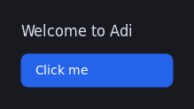
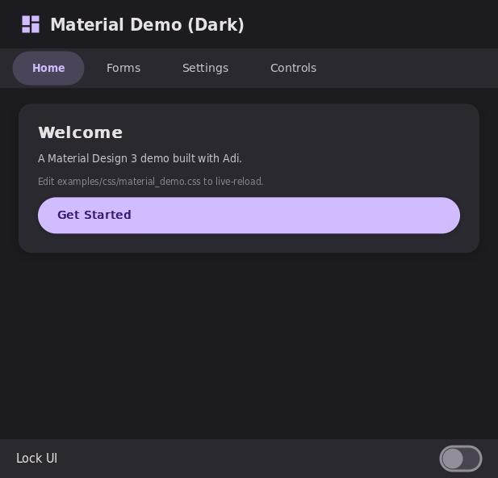
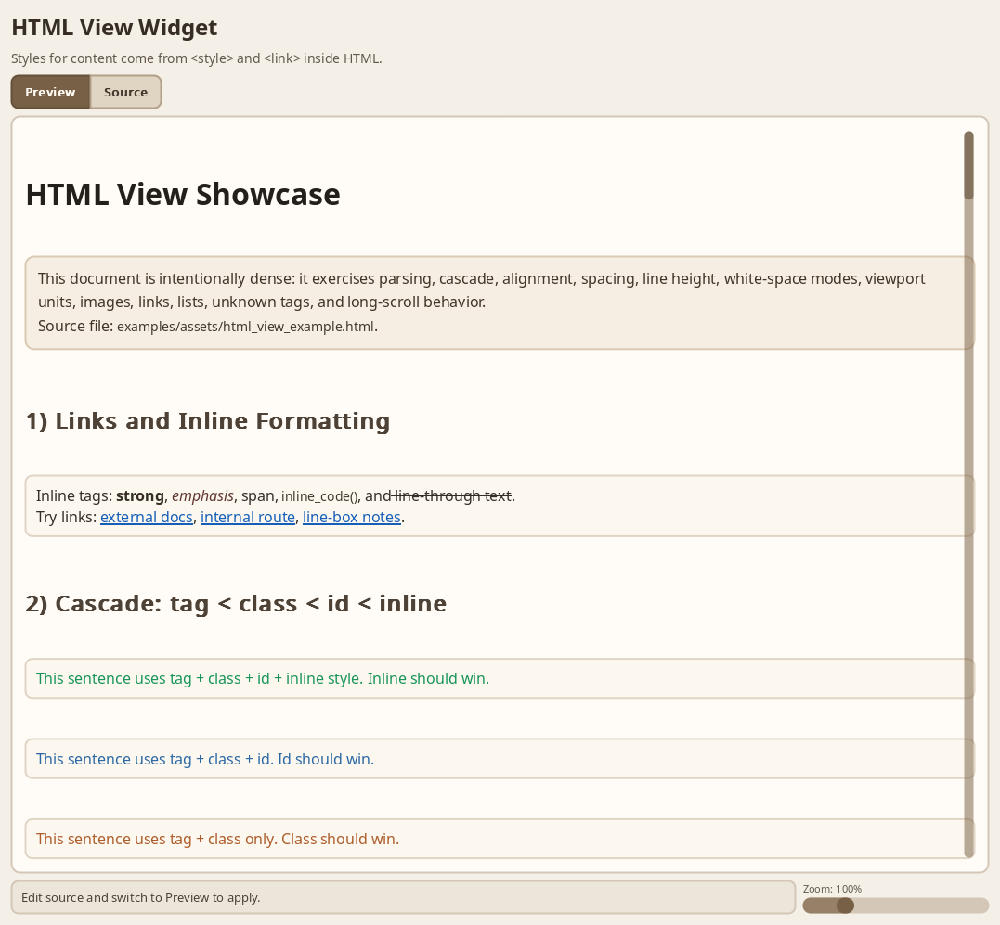
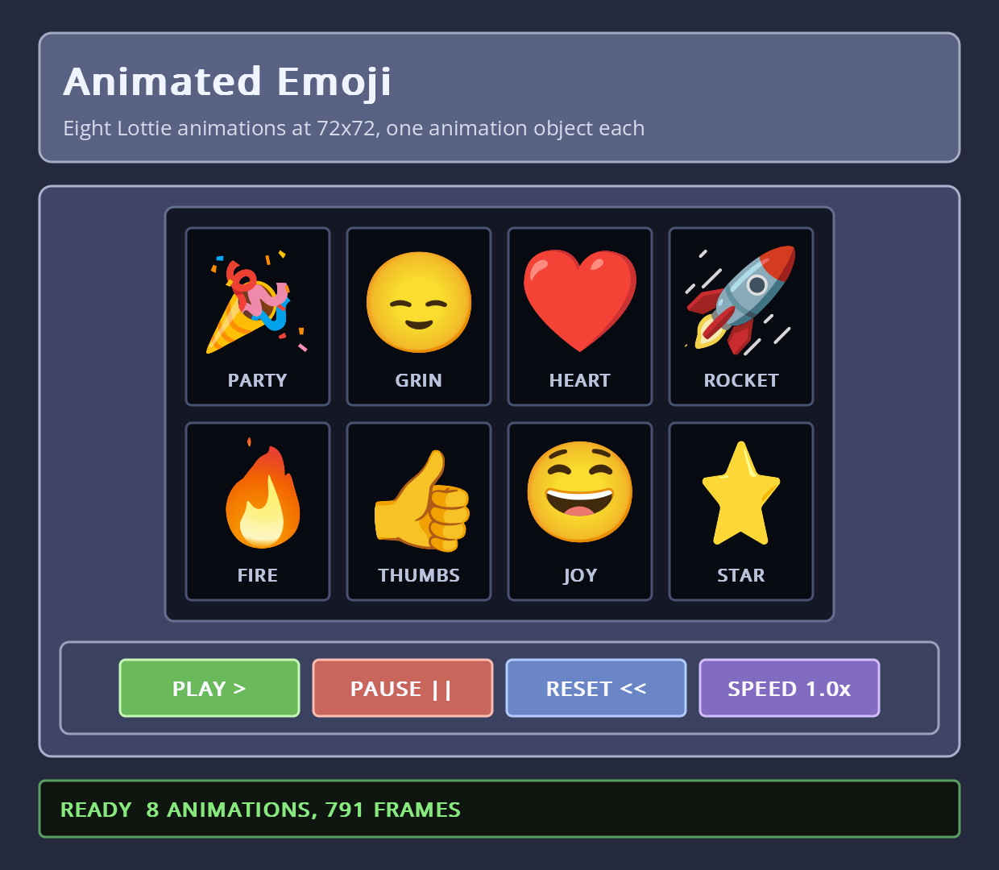
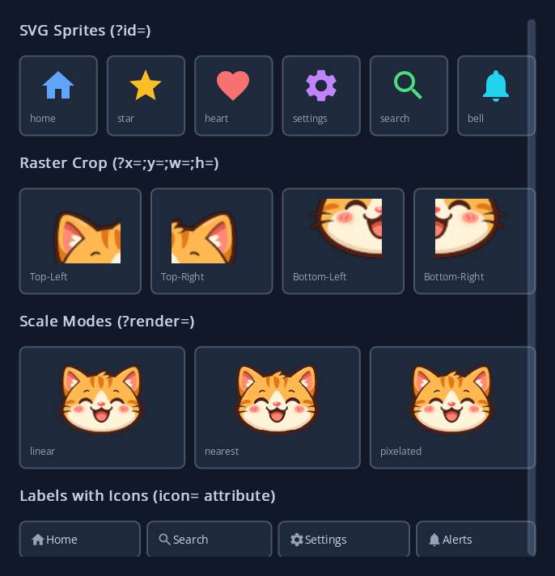

# Adi2

**A modern GUI library for Ada.**

Adi2 gives you a real widget toolkit with the niceties developers expect from a modern UI stack — CSS-like styling with live reload, declarative XML layouts, animations, SVG and Lottie graphics, internationalization, and asset bundling — implemented natively in Ada on top of SDL3.

> **Status:** in production use, but not yet a stable release — APIs may still change between versions.

---

## Why Adi2?

- **Style your UI like the web.** Selectors, pseudo-classes, parts, transitions, gradients, box shadows — all in a familiar `.css` syntax. Edit the file, save, see the change. No recompile during development. Prefer pure Ada? CSS rules are just plain Ada aggregates of `Style_Rules` — write them by hand with no extra ceremony (see the snippet below).
- **Describe UIs declaratively — or don't.** Write `<button>`, `<grid>`, `<text-editor>` in XML and let the toolchain emit clean Ada packages, *or* construct the same widget tree directly in Ada with handle-based builders. Both paths target the exact same API; the XML generator is a convenience, not a requirement.
- **Render rich content.** A built-in lightweight HTML view widget renders documentation-style markup with cascading styles. Raster images through SDL3_image, SVG through the bundled plutosvg, Lottie animations through bundled rlottie.
- **Ship a single binary.** Bundle every CSS file, font, image, translation, and SVG sprite into your executable. No filesystem dependencies at runtime.
- **Speak the user's language.** Gettext-compatible i18n with plural forms, automatic locale detection, and `.po` → Ada compilation.
- **Animate without boilerplate.** CSS transitions on `color`, `background-color`, `border-color`, `border-width`, `border-radius`, `padding`, `margin`, `opacity`, `box-shadow` and `font-size` — the framework handles interpolation and timing.
- **HiDPI-ready units.** `dp`/`dip` for layout, `rem` for typography, `pix` when you mean one renderer pixel exactly, and `px` — which follows the display scale or not, depending on `Set_Px_Maps_To_Dip`. See [`docs/css_styling.md`](docs/css_styling.md).
- **Built for tooling and automation.** A development-only MCP bridge lets editors and AI assistants screenshot the running app, walk the widget tree, *and* drive it — clicking buttons, typing into inputs, moving focus, reading performance counters. Great for end-to-end tests written by your AI of choice.
- **Runs in the browser.** The examples compile to WebAssembly with GNAT-LLVM and Emscripten — [try them live](https://pizzahack.eu/adi2/demo/), or see [`wasm/`](wasm/) for the build.

---

## Screenshots


*`hello_example`*


*`material_demo`*


*`html_view_example`*


*`rlottie_example`*


*`assets_example`*

Full gallery of every example: [`docs/gallery.md`](docs/gallery.md). Or run them yourself, in the browser: [**live demos**](https://pizzahack.eu/adi2/demo/).

---

## A taste

### Declarative path — XML + CSS

```css
/* examples/css/hello_example.css */
.primary {
  background-color: rgb(37, 99, 235);
  border-radius: 8px;
  padding: 10px 16px;
  transition: background-color 150ms ease-out;
}
.primary:hover  { background-color: rgb(29, 78, 216); }
.primary::label { color: white; font-size: 14px; font-weight: 500; }
```

```xml
<!-- examples/xml/hello_example.xml -->
<adi>
  <link rel="stylesheet" href="examples/css/hello_example.css"/>
  <callback name="On_Hello_Click" type="Adi.Widget.Button.Click_Callback"/>
  <window title="Hello, Adi" width="320" height="180">
    <box class="root">
      <label text="Welcome to Adi" class="welcome"/>
      <button text="Click me" class="primary" on-clicked="On_Hello_Click"/>
    </box>
  </window>
</adi>
```

The toolchain emits a typed Ada package you instantiate from your `main` — see [`examples/hello_example.adb`](examples/hello_example.adb) for the full ~25-line program.

### Same thing, written by hand in Ada

The CSS rule above is just an aggregate. The XML widget tree is just a few constructor calls. Both paths land on the same API — see [`examples/hello_raw_example.adb`](examples/hello_raw_example.adb) for the full equivalent program. The shape of the styling code is:

```ada
function Style return Style_Builder renames Adi.Widget_Styles.Create;

--  Equivalent of .primary base + :hover from hello_example.css
Primary_Base : constant Style_Rules :=
  (Background_Color => Set_Bg (RGB (37, 99, 235)),
   Border_Radius    => Set (Radius (Px (8.0))),
   Padding          => Set (CSS_Box (Px (10.0), Px (16.0))),
   Transition       => Set ((Duration   => 0.15,
                             Easing     => Ease_Out,
                             Properties => Props (Prop_Background_Color))),
   others           => <>);

Primary_Hover : constant Style_Rules :=
  (Background_Color => Set_Bg (RGB (29, 78, 216)),
   others           => <>);

--  Wire base + hover to the button's Main_Part
Set_Part_Style (Widget_Handle'(+Btn), Main_Part,
  Style.Base (Primary_Base).On_Hover (Primary_Hover).Build);
```

Build and run either flavour:

```bash
tools/build_examples.sh hello_example hello_raw_example
./examples/bin/hello_example       # XML + CSS pipeline
./examples/bin/hello_raw_example   # pure hand-written Ada
```

---

## Quick start

```bash
# Build the library
alr build -- -j0

# Build and run the test suite
tools/run_tests.sh

# Build all example programs
tools/build_examples.sh

# ...or just one
tools/build_examples.sh stack_example

# Try a demo
./examples/bin/material_demo
./examples/bin/html_view_example
```

To use Adi2 from your own project, `with "adi.gpr"` — SDL linker options come with it. The library's public specs use Ada 2022 constructs, so units that `with Adi.*` packages need `pragma Ada_2022;` or `-gnat2022`.

**Starting your own project?** [`docs/getting_started.md`](docs/getting_started.md) walks from an empty directory to a working window, in XML/CSS and again in plain Ada.

Full build instructions, including building without Alire, in [`docs/build.md`](docs/build.md) and [`docs/gprbuild_without_alire.md`](docs/gprbuild_without_alire.md).

---

## Roadmap

- **Better generated docs** — produce browsable API documentation with `gnatdoc`.
- **Live reload for XML UIs** — CSS already hot-reloads during development; XML widget trees should too.
- **SPARK / contracts** — add `Pre`/`Post`/`Type_Invariant` and SPARK-mode subsets to the core for stronger guarantees on widget lifecycle and style cascade.
- **C API** — expose a stable C-callable interface so non-Ada languages (C, C++, Rust, Python via FFI, etc.) can drive Adi2.

Have an idea? Open an issue (see [`CONTRIBUTING.md`](CONTRIBUTING.md) for the policy).

---

## Supported platforms

Anywhere GNAT and SDL3 build — Linux, Windows, macOS, BSDs. Actively tested on **GNU/Linux** and **Windows (MinGW)**.

Rendering goes through the SDL renderer abstraction, so you get hardware-accelerated graphics with extremely broad portability — Adi2 has been observed running cleanly on **Windows XP** with no special effort.

---

## Questions

**Why "Adi2"? And why is the Ada package still `Adi.*`?**
"adi" is too common a word for search engines — *Adi2* is findable. The in-code namespace stays `Adi.*` because `with Adi.Widget.Button;` reads better than `Adi2.Widget.Button` and renaming it would churn every source file for zero functional gain. Project = Adi2, package = `Adi`.

---

## Talk

*A Native, Portable GUI Framework for Ada* — 3rd Ada Developers Workshop, [AEiC 2026](https://www.ada-europe.org/conference2026/workshop_adadev.html), 13 June 2026. Building an Adi2 application, and driving the running UI from an LLM through the MCP bridge.

[Part 1](https://www.youtube.com/watch?v=d-RISfK9Sy8) · [Part 2](https://www.youtube.com/watch?v=H8SMfI7dJfc)

---

## Go deeper

| Topic | Doc |
|---|---|
| Your first Adi2 application | [`docs/getting_started.md`](docs/getting_started.md) |
| High-level architecture and core components | [`docs/architecture.md`](docs/architecture.md) |
| CSS styling — selectors, properties, runtime API, codegen | [`docs/css_styling.md`](docs/css_styling.md) |
| Declarative XML UIs and the widget grammar | [`docs/xml_ui_system.md`](docs/xml_ui_system.md) |
| HTML view widget specification | [`docs/html_view_spec.md`](docs/html_view_spec.md) |
| Static asset bundling (single-binary deployments) | [`docs/static_assets.md`](docs/static_assets.md) |
| Internationalization, plurals, `.po` compilation | [`docs/i18n.md`](docs/i18n.md) |
| Settings store with JSON backend | [`docs/settings.md`](docs/settings.md) |
| OS integration — dialogs, clipboard, paths | [`docs/os_integration.md`](docs/os_integration.md) |
| Signals and deferred dispatch | [`docs/signals.md`](docs/signals.md) |
| Antialiased rendering primitives | [`docs/rendering_aa.md`](docs/rendering_aa.md) |
| MCP runtime introspection and interaction | [`docs/mcp.md`](docs/mcp.md) |
| Handle ownership model | [`docs/handle_ownership.md`](docs/handle_ownership.md) |
| Coding conventions | [`docs/coding_conventions.md`](docs/coding_conventions.md) |
| Adding a CSS property / example / test | [`docs/adding_css_property.md`](docs/adding_css_property.md), [`docs/adding_example.md`](docs/adding_example.md), [`docs/adding_test.md`](docs/adding_test.md) |

---

## Contributing

**Issues and pull requests welcome.**

For anything beyond a small fix, please open an issue first so the approach can be discussed before you invest time in it. Match the existing code style ([`docs/coding_conventions.md`](docs/coding_conventions.md)), keep the tests green, and add tests for new behaviour.

Unless you explicitly state otherwise, contributions you submit are understood to be under the Apache-2.0 license, as per its Section 5 — no CLA to sign. Full details in [`CONTRIBUTING.md`](CONTRIBUTING.md).

---

## Sponsoring

Adi2 is independently developed and maintained. Sponsorship funds ongoing maintenance, cross-platform testing, documentation, and work on the public roadmap.

Organisations interested in supporting the project, or in funding a specific feature, port, or integration: **adi@aldustechnology.com**.

Sponsorship supports the project as a whole. Guaranteed response times or delivery commitments require a separate commercial agreement.

---

## License

Apache-2.0. See [`LICENSE`](LICENSE).

Vendored third-party code under [`vendor/`](vendor/) retains its original licenses, listed in each tree's own license files. Most are permissive — MIT, Apache-2.0, BSD-style, OFL. `vendor/rlottie/src/vector/vinterpolator.cpp` is MPL-2.0, a file-level copyleft rather than a permissive licence; its text ships as [`vendor/rlottie/licenses/COPYING.MPL`](vendor/rlottie/licenses/COPYING.MPL).

Example assets under [`examples/assets/`](examples/assets/) are demonstration content rather than part of the library; those with known third-party terms are attributed in [`examples/assets/NOTICE.md`](examples/assets/NOTICE.md).

---

## Contact

Adi2 is written by **Aldo Nicolas Bruno**. Report bugs and propose features through the issue tracker. For private enquiries, sponsored development, or commercial support: **adi@aldustechnology.com**.
