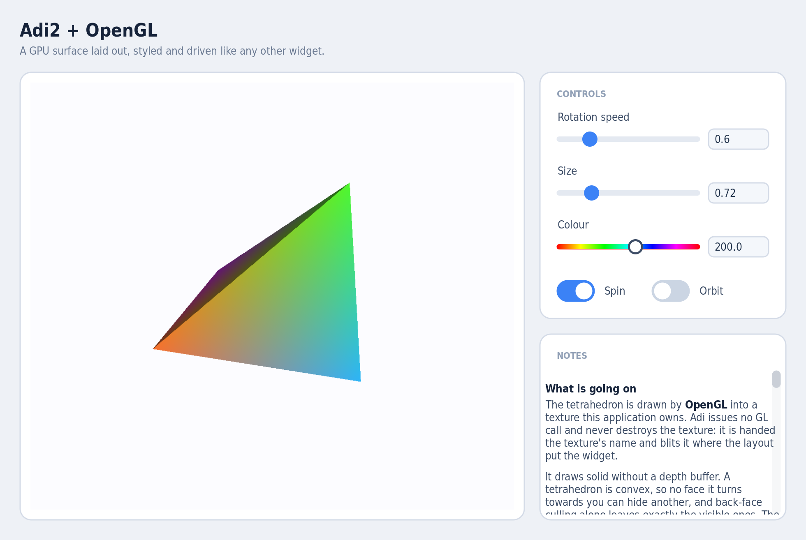

# Adi2

[](https://github.com/ovenpasta/adi2/actions/workflows/linux.yml)
[](https://github.com/ovenpasta/adi2/actions/workflows/windows.yml)
[](https://github.com/ovenpasta/adi2/actions/workflows/reuse.yml)

**A GUI library for Ada.**

A widget toolkit written in Ada on SDL3: CSS styling with live reload, XML layouts compiled to Ada, transitions, SVG and Lottie, internationalization, and asset bundling.

> **Status:** in production use, before a stable release; APIs still change between versions.

---

## What it does

- **CSS.** Selectors, pseudo-classes, parts, transitions, gradients and box shadows in ordinary `.css`. Edit the file, save, and the running window restyles. The same rules are plain Ada aggregates of `Style_Rules`, written by hand where a stylesheet is unwanted (snippet below).
- **XML, or Ada.** `<button>`, `<grid>`, `<text-editor>` in XML become typed Ada packages, or the same tree is built in Ada with handle-based constructors. Both reach one API.
- **Rich content.** An HTML view widget renders documentation-style markup with cascading styles. Raster images through SDL3_image, SVG through the bundled plutosvg, Lottie animations through the bundled rlottie.
- **One binary.** CSS, fonts, images, translations and SVG sprites bundle into the executable, so the program runs from any directory.
- **Translation.** Gettext-compatible i18n with contexts, plural forms, locale detection, and `.po` to Ada compilation.
- **Transitions.** CSS transitions on `color`, `background-color`, `border-color`, `border-width`, `border-radius`, `padding`, `margin`, `opacity`, `box-shadow` and `font-size`.
- **Keyboard and clipboard.** Tab and Shift+Tab traverse focusable widgets, overlays trap focus, arrow keys drive lists, combos and sliders. Text inputs and editors take Ctrl+C/V/X/A and open a context menu. An application hook sees every key first, so shortcuts beat focus.
- **HiDPI units.** `dp`/`dip` for layout, `rem` for typography, `pix` for one renderer pixel exactly, and `px`, which follows the display scale or not, as `Set_Px_Maps_To_Dip` says. See [`docs/css_styling.md`](docs/css_styling.md).
- **Introspection.** A development-only MCP bridge lets an editor or an assistant screenshot the running app, walk the widget tree, and drive it: clicking buttons, typing into inputs, moving focus, reading performance counters.
- **The browser.** The examples compile to WebAssembly with GNAT-LLVM and Emscripten: [live demos](https://pizzahack.eu/adi2/demo/), and [`wasm/`](wasm/) for the build.

### What it costs to ship

A release build links statically into a single executable under 10 MB:
the widget toolkit, the CSS engine, SVG and Lottie rendering. Bundled
assets add their own weight.

It draws through SDL's renderer, which binds to whatever the host offers:
Direct3D on Windows, Metal on macOS, Vulkan or OpenGL where they exist,
software as the floor. Windows XP takes Direct3D 9 and a current Mac takes
Metal, from the same source.

|  | Adi2 | Qt | Flutter | Electron |
|---|---|---|---|---|
| Ship size | <10 MB, one file | ~15–30 MB static; otherwise a Qt runtime alongside | ~20 MB+, engine plus a data directory | ~100 MB+, bundling Chromium and Node |
| Runtime | self-contained | Qt libraries and plugins | Flutter engine; GTK3 on Linux | Chromium and Node |
| Graphics | SDL renderer, software fallback included | GPU or raster backends | Skia or Impeller, GPU expected | GPU stack and compositor |
| Portability | Windows XP+, macOS, Linux, WebAssembly | Windows 10+, macOS, Linux, mobile, embedded | Windows 10+, macOS, Linux, mobile, web | Windows 10+, macOS, Linux |
| Language | Ada | C++ | Dart | JavaScript |
| Memory safety | checked, deterministic reclamation | manual | garbage-collected | garbage-collected |
| Styling | CSS | QSS | Dart widget code | CSS |

Sizes are for a minimal application; yours grows with your own code and
assets. Each of the others buys its size with a large ecosystem and years
of production use; Adi2 offers a single file, on hardware the others have
moved past.

---

## Screenshots


*`hello_example`*


*`material_demo`*


*`html_view_example`*


*`rlottie_example`*


*`assets_example`*

Full gallery of every example: [`docs/gallery.md`](docs/gallery.md). Or run them yourself, in the browser: [**live demos**](https://pizzahack.eu/adi2/demo/).

---

## A taste

### XML and CSS

```css
/* examples/css/hello_example.css */
.primary {
  background-color: rgb(37, 99, 235);
  border-radius: 8px;
  padding: 10px 16px;
  transition: background-color 150ms ease-out;
}
.primary:hover  { background-color: rgb(29, 78, 216); }
.primary::label { color: white; font-size: 14px; font-weight: 500; }
```

```xml
<!-- examples/xml/hello_example.xml -->
<adi>
  <link rel="stylesheet" href="examples/css/hello_example.css"/>
  <callback name="On_Hello_Click" type="Adi.Widget.Button.Click_Callback"/>
  <window title="Hello, Adi" width="320" height="180">
    <box class="root">
      <label text="Welcome to Adi" class="welcome"/>
      <button text="Click me" class="primary" on-clicked="On_Hello_Click"/>
    </box>
  </window>
</adi>
```

The toolchain emits a typed Ada package that `main` instantiates; [`examples/hello_example.adb`](examples/hello_example.adb) is the full program.

### The same, written in Ada

The CSS rule is an aggregate and the widget tree is a few constructor calls; [`examples/hello_raw_example.adb`](examples/hello_raw_example.adb) is the full equivalent program. The styling code has this shape:

```ada
function Style return Style_Builder renames Adi.Widget_Styles.Create;

--  Equivalent of .primary base + :hover from hello_example.css
Primary_Base : constant Style_Rules :=
  (Background_Color => Set_Bg (RGB (37, 99, 235)),
   Border_Radius    => Set (Radius (Px (8.0))),
   Padding          => Set (CSS_Box (Px (10.0), Px (16.0))),
   Transition       => Set ((Duration   => 0.15,
                             Easing     => Ease_Out,
                             Properties => Props (Prop_Background_Color))),
   others           => <>);

Primary_Hover : constant Style_Rules :=
  (Background_Color => Set_Bg (RGB (29, 78, 216)),
   others           => <>);

--  Wire base + hover to the button's Main_Part
Set_Part_Style (Widget_Handle'(+Btn), Main_Part,
  Style.Base (Primary_Base).On_Hover (Primary_Hover).Build);
```

Build and run either flavour:

```bash
tools/build_examples.sh hello_example hello_raw_example
./examples/bin/hello_example       # XML + CSS pipeline
./examples/bin/hello_raw_example   # pure hand-written Ada
```

---

## Quick start

```bash
# Build the library
alr build -- -j0

# Build and run the test suite
tools/run_tests.sh

# Build all example programs
tools/build_examples.sh

# ...or just one
tools/build_examples.sh stack_example

# Try a demo
./examples/bin/material_demo
./examples/bin/html_view_example
```

To use Adi2 from your own project, `with "adi.gpr"`; the SDL linker options come with it. The library's public specs use Ada 2022 constructs, so units that `with Adi.*` packages need `pragma Ada_2022;` or `-gnat2022`.

[`docs/getting_started.md`](docs/getting_started.md) walks from an empty directory to a working window, in XML/CSS and again in plain Ada.

Full build instructions, including building without Alire, in [`docs/build.md`](docs/build.md) and [`docs/gprbuild_without_alire.md`](docs/gprbuild_without_alire.md).

---

## Extras

Companion crates under [`extras/`](extras/). Each is its own Alire crate
with its own dependencies, so the library never acquires them.

### `opengl_demo`



A tetrahedron drawn by OpenGL into a texture the application owns, shown
through a `texture-view` widget and driven by ordinary Adi sliders and
switches. Adi issues no GL call and never destroys the texture: it is
handed the texture's name and blits it where the layout put the widget,
under the same clipping and opacity as anything else.

```bash
cd extras/opengl_demo
./gen.sh          # Ada from the crate's XML and CSS
alr build
./bin/gl_triangle
```

How the widget works, and the other ways to hand it a surface —
Direct3D, Vulkan, or plain CPU pixels — in
[`docs/texture_view.md`](docs/texture_view.md).

---

## Roadmap

**CSS.**

- **Broader CSS surface** — more standard properties, selectors and values.

**HTML view.**

- **Tables** — `table`, `tr`, `td`/`th`, column widths, spanning.
- **Flex and grid** — `display: flex` and `display: grid` inside the document.

**Widgets and themes.**

- **More widgets** — tree view, data grid, menu bar, progress and busy indicators, tooltips, split panes, date and colour pickers.
- **Ready-made themes** — Material, Fluent, Adwaita and macOS, each in light and dark.

**Input and interaction.**

- **Keyboard shortcuts** — accelerators bound to actions, scoped globally or to a subtree, shown in menus, with the platform's own modifier conventions.
- **Drag and drop** — between widgets, and from the OS.

**Text and reach.**

- **Right-to-left and bidirectional text** — `direction` and bidi reordering.
- **Accessibility** — semantic roles, names and states to screen readers over AT-SPI, UI Automation and NSAccessibility.

**Portability.**

- **Pluggable backends** — an abstraction layer that lets Win32/Direct2D, Cocoa, GLFW, raylib or Skia take the place of SDL3 ([design notes](docs/proposals/HAL.md)).
- **Embedded devices**

**Authoring and tooling.**

- **Visual designer** — RAD IDE like experience, edit both the UI XML and CSS.
- **Scripting with HAC** — embed the HAC Ada compiler for reloadable application logic.
- **Live reload for XML UIs** — XML widget trees hot-reload as CSS already does.
- **Better generated docs** — browsable API documentation with `gnatdoc`.

**Correctness and API.**

- **Better callbacks** — a callback that fails leaves the app running, callbacks that fire once, and background work that talks to the UI safely ([design notes](docs/proposals/callback_dispatch_model.md)).
- **Contracts** — `Pre`/`Post`/`Type_Invariant` and SPARK-mode subsets.
- **C API** — a stable C-callable interface for non-Ada callers.

Proposals go through an issue; [`CONTRIBUTING.md`](CONTRIBUTING.md) has the policy.

---

## Supported platforms

Tested on **GNU/Linux**, **Windows** (XP, 7, 8, 10, 11, via MinGW), **macOS**, and **WebAssembly** (Emscripten). Anywhere else GNAT and SDL3 build should follow, the BSDs among them.

Rendering goes through the SDL renderer abstraction, so it takes hardware acceleration where the machine offers it and falls back to software where it does not. That is what puts the same binary on Windows XP and on a current desktop.

---

## Questions

**Why "Adi2", and why is the Ada package `Adi.*`?**
"adi" is too common a word for search engines; *Adi2* is findable. The namespace stays `Adi.*` because `with Adi.Widget.Button;` reads better than `Adi2.Widget.Button`. Project = Adi2, package = `Adi`.

---

## Talk

*A Native, Portable GUI Framework for Ada* — 3rd Ada Developers Workshop, [AEiC 2026](https://www.ada-europe.org/conference2026/workshop_adadev.html), 13 June 2026. Building an Adi2 application, and driving the running UI from an LLM through the MCP bridge.

[Part 1](https://www.youtube.com/watch?v=d-RISfK9Sy8) · [Part 2](https://www.youtube.com/watch?v=H8SMfI7dJfc)

---

## Go deeper

| Topic | Doc |
|---|---|
| Your first Adi2 application | [`docs/getting_started.md`](docs/getting_started.md) |
| High-level architecture and core components | [`docs/architecture.md`](docs/architecture.md) |
| CSS styling — selectors, properties, runtime API, codegen | [`docs/css_styling.md`](docs/css_styling.md) |
| Declarative XML UIs and the widget grammar | [`docs/xml_ui_system.md`](docs/xml_ui_system.md) |
| HTML view widget specification | [`docs/html_view_spec.md`](docs/html_view_spec.md) |
| Texture view — showing a surface your app drew on the GPU | [`docs/texture_view.md`](docs/texture_view.md) |
| Static asset bundling (single-binary deployments) | [`docs/static_assets.md`](docs/static_assets.md) |
| Internationalization, plurals, `.po` compilation | [`docs/i18n.md`](docs/i18n.md) |
| Settings store with JSON backend | [`docs/settings.md`](docs/settings.md) |
| OS integration — dialogs, clipboard, paths | [`docs/os_integration.md`](docs/os_integration.md) |
| Signals and deferred dispatch | [`docs/signals.md`](docs/signals.md) |
| Antialiased rendering primitives | [`docs/rendering_aa.md`](docs/rendering_aa.md) |
| MCP runtime introspection and interaction | [`docs/mcp.md`](docs/mcp.md) |
| Handle ownership model | [`docs/handle_ownership.md`](docs/handle_ownership.md) |
| Coding conventions | [`docs/coding_conventions.md`](docs/coding_conventions.md) |
| Adding a CSS property / example / test | [`docs/adding_css_property.md`](docs/adding_css_property.md), [`docs/adding_example.md`](docs/adding_example.md), [`docs/adding_test.md`](docs/adding_test.md) |

---

## Contributing

**Issues and pull requests welcome.**

Before beginning a new feature, a change in behaviour, or a substantial
refactoring, open an issue so that the proposed approach can be
discussed. Follow the existing code style
([`docs/coding_conventions.md`](docs/coding_conventions.md)), keep the
tests green, and add tests for new behaviour.

Adi2 is licensed under **Apache-2.0**. See
[`CONTRIBUTING.md`](CONTRIBUTING.md#licensing-of-contributions) for the
contributor licensing terms, including when acceptance of the
[Contributor License Agreement](CLA.md) is required.

---

## Sponsoring

Adi2 is independently developed and maintained. Sponsorship funds ongoing maintenance, cross-platform testing, documentation, and work on the public roadmap.

Organisations interested in supporting the project, or in funding a specific feature, port, or integration: **adi@aldustechnology.com**.

Sponsorship supports the project as a whole. Guaranteed response times or delivery commitments require a separate commercial agreement.

---

## License

Apache-2.0. See [`LICENSE`](LICENSE).

Every file in the repository carries a declared licence and copyright, checked in CI against the [REUSE](https://reuse.software/) specification. [`REUSE.toml`](REUSE.toml) holds the declarations and [`LICENSES/`](LICENSES/) the full text of every licence in use; `reuse spdx` will produce an SPDX bill of materials from them.

Vendored third-party code under [`vendor/`](vendor/) is mostly permissive — MIT, Apache-2.0, BSD-style, OFL. Two obligations do not follow automatically from shipping that inventory, and apply to anyone distributing a binary built from this source:

- **FreeType.** Both `vendor/rlottie/src/vector/freetype/` and plutovg's `plutovg-ft-*` files are under the FreeType Licence, and Adi2 links them statically. A binary distribution must state in its documentation that the software is based in part of the work of the FreeType Team. Redistributing the source instead requires retaining `FTL.TXT` unaltered, preserving the original copyright notices, and marking any changes.
- **MPL-2.0.** `vendor/rlottie/src/vector/vinterpolator.cpp` is file-level copyleft. Distributing a build that contains it obliges telling recipients how to obtain that file's source form; modifications to it must be made available under the same licence.

Example assets under [`examples/assets/`](examples/assets/) are demonstration content rather than part of the library; those with known third-party terms are attributed in [`examples/assets/NOTICE.md`](examples/assets/NOTICE.md).

---

## Contact

Adi2 is written by **Aldo Nicolas Bruno**. Report bugs and propose features through the issue tracker. For private enquiries, sponsored development, or commercial support: **adi@aldustechnology.com**.
