# Example gallery

Every example program in [`examples/`](../examples/), captured as a screenshot. Build any of them with `tools/build_examples.sh <name>` and run from `examples/bin/<name>`.

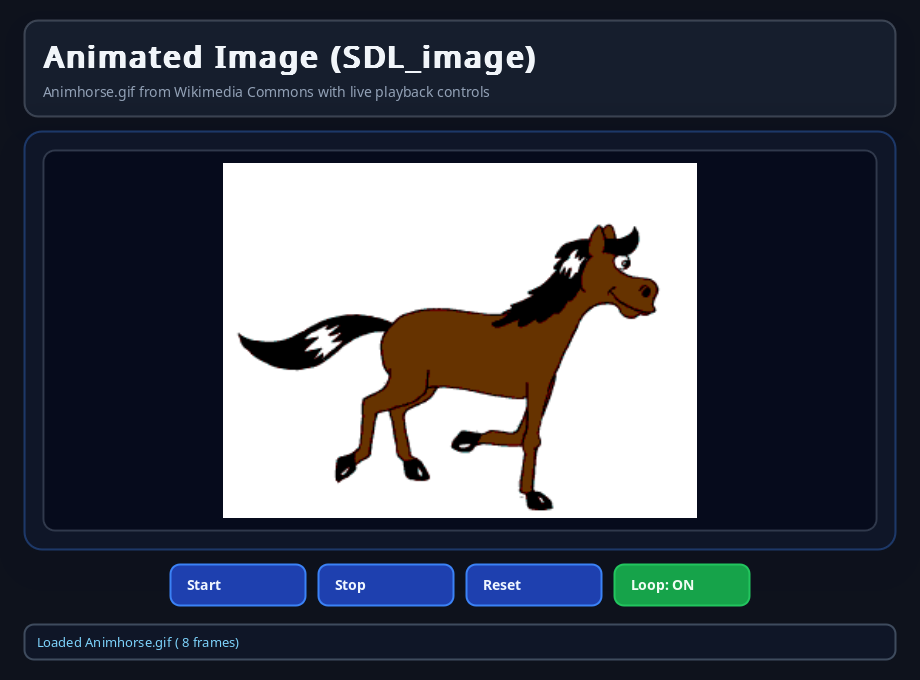
*`animated_image_example`*

*`assets_example`*

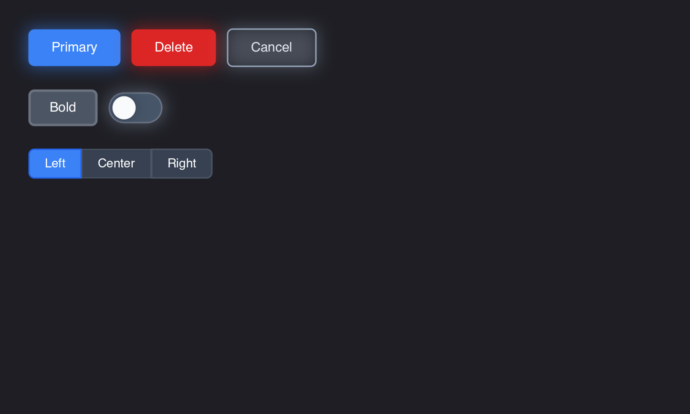
*`button_example`*

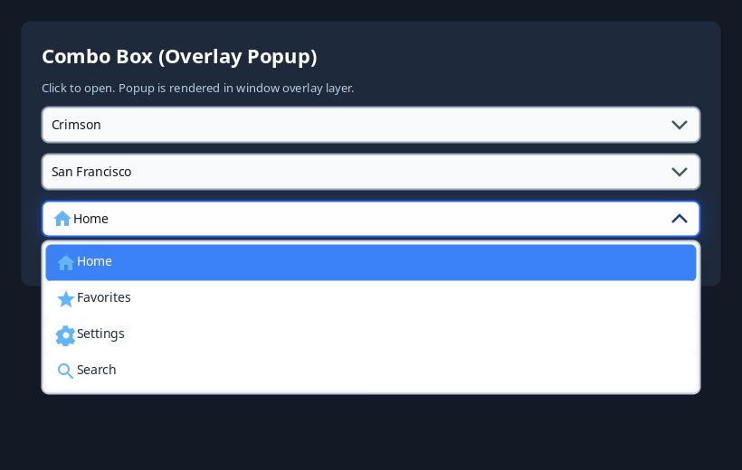
*`combo_box_example`*

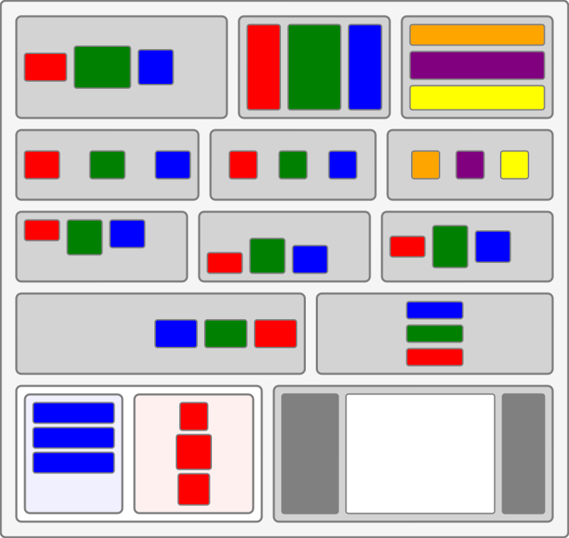
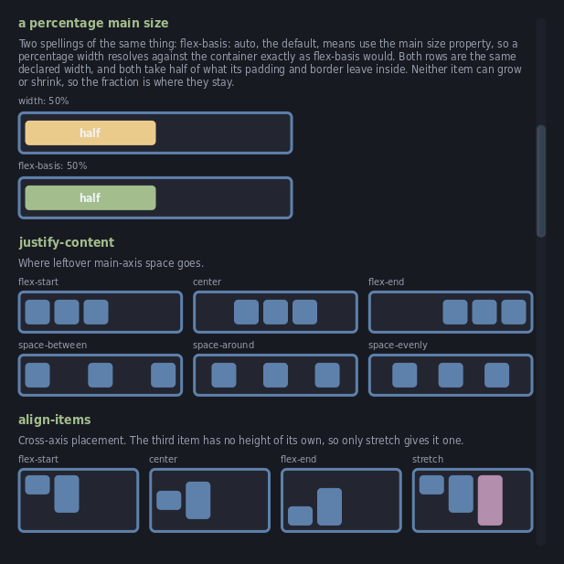
*`demo_flex`*

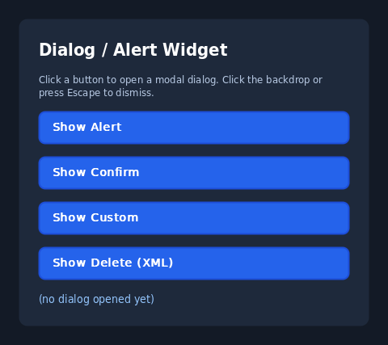
*`dialog_example`*

*`font_example`*

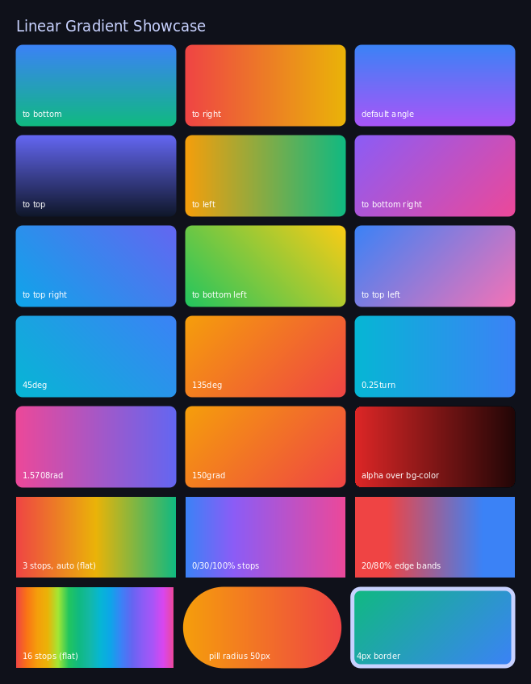
*`gradient_example`*

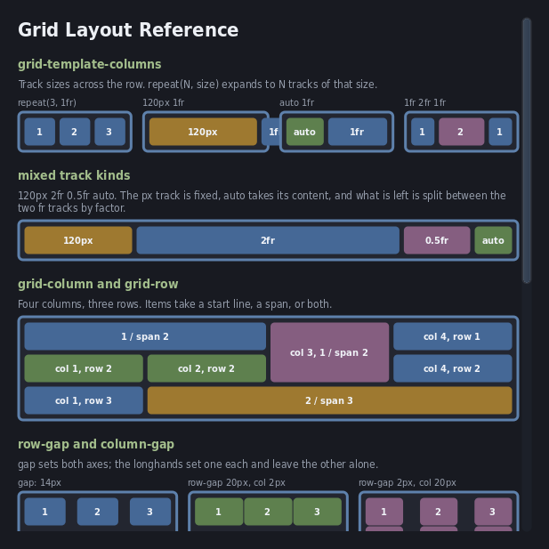
*`grid_example`*

*`hello_example`*

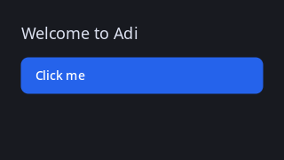
*`hello_raw_example`*

*`html_view_example`*

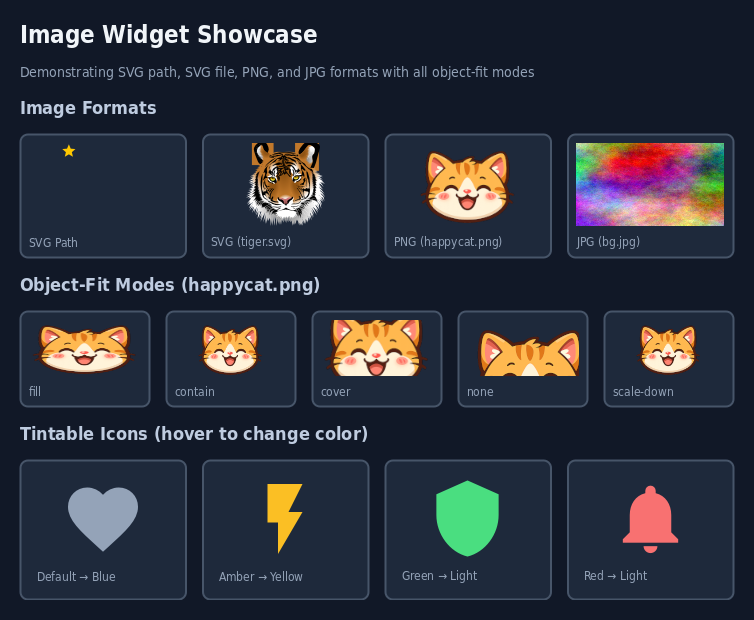
*`image_example`*

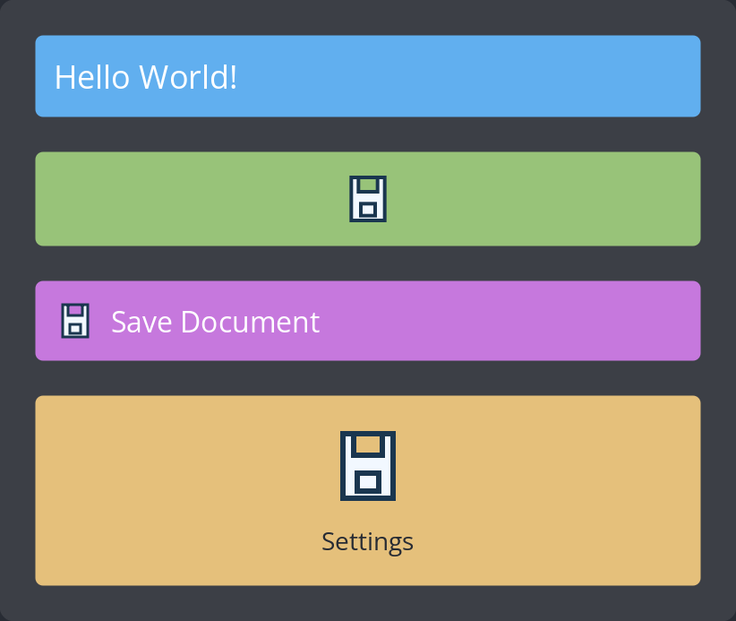
*`label_example`*

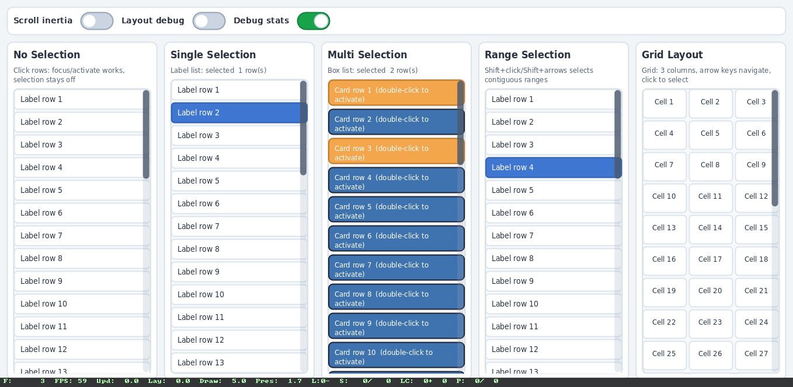
*`list_box_example`*

*`material_demo`*

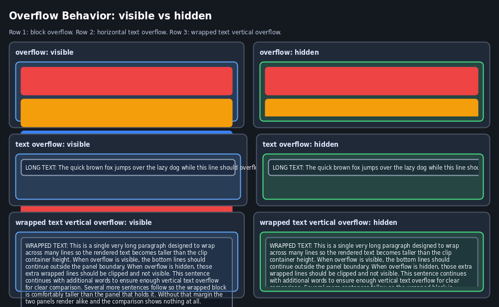
*`overflow_example`*

*`rlottie_example`*

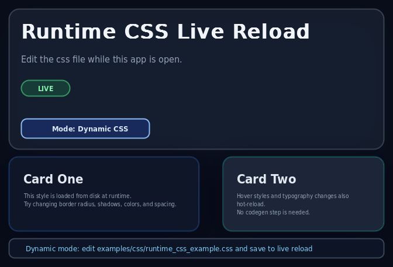
*`runtime_css_example`*

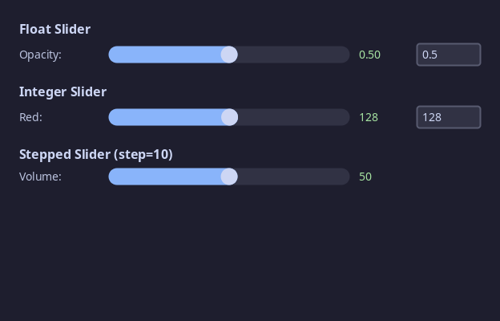
*`slider_example`*

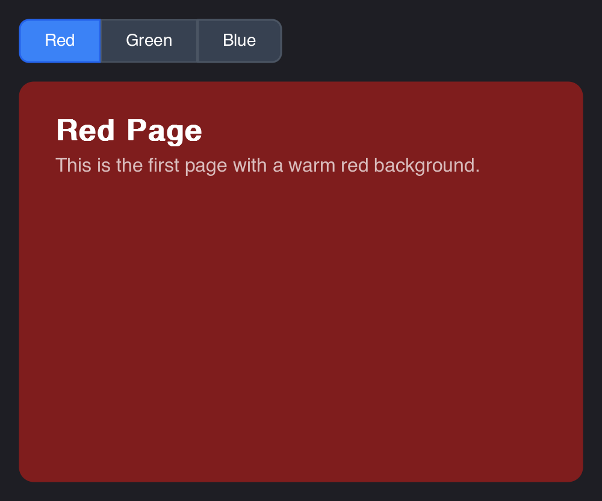
*`stack_example`*

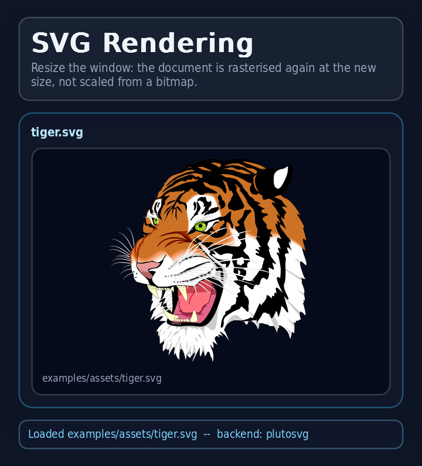
*`svg_example`*

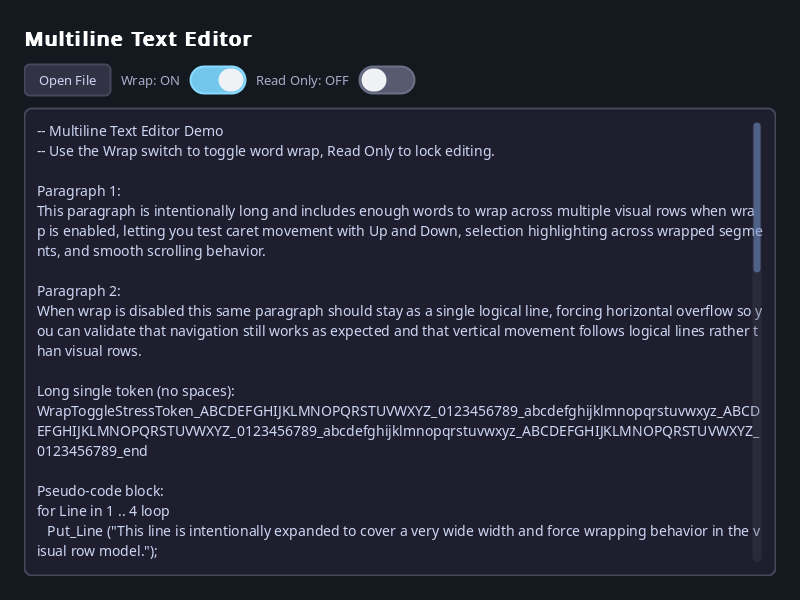
*`text_editor_example`*

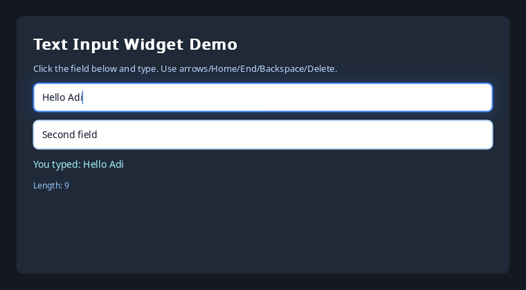
*`text_input_example`*

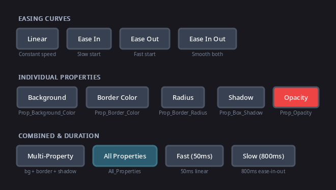
*`transition_example`*

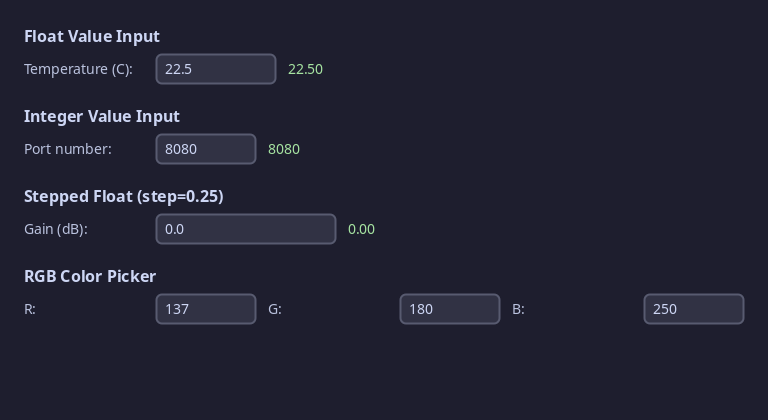
*`value_input_example`*
